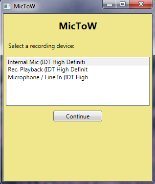
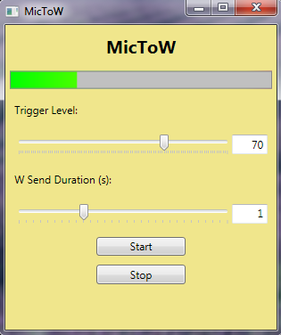

## MicToW

MicToW is a program that monitors the microphone and sends w key presses to the active window when a threshold is exceeded. It's designed to be used with an omnidirectional treadmill such as the [Wizdish ROVR](http://www.wizdish.com/) to use as a game controller. You can find information about my DIY treadmil TolDish [here](http://tolgainci.com.tr/2017/10/10/toldish-a-diy-omnidirectional-treadmill/).

The program is basically a modified version of [.NET Voice Recorder](https://github.com/markheath/voicerecorder) by Mark Heath, which uses nAudio library to monitor microphone input and uses [InputManager](https://www.codeproject.com/Articles/117657/InputManager-library-Track-user-input-and-simulate) library by Shynet to send w key presses. 

## Installation

Download [mictow_setup.exe](http://www.tolgainci.com.tr) and install.

## Usage
On the first screen, select the preferred input device and click continue.

On the second screen, adjust the desired "Trigger Level" and "W Send Duration" and press Start. "Trigger Level" is between 1 and 100 and indicates when w key press will be sent. Lower values will result in soft noises triggering key presses, while higher values will require louder noises to trigger key press. "W Send Duration" can be set at 0.1 second intervals, up to 3 seconds. For example, if the setting is 2 seconds, the program will send a stream of w key presses for 2 seconds. This is useful to keep w pressed in between your steps on the treadmill. Press "Stop" to stop sending keys. It's not necessary to push "Stop" while adjusting values.

## ToDo
The program is currently loaded with unnecessary code from .NET Voice Recorder. So far removing them proved to be difficult. It probably makes more sense to write a project from scratch using the nAudio and InputManager libraries. I plan to attempt to do that when I have more time. Any help is welcome :)

Enjoy!
